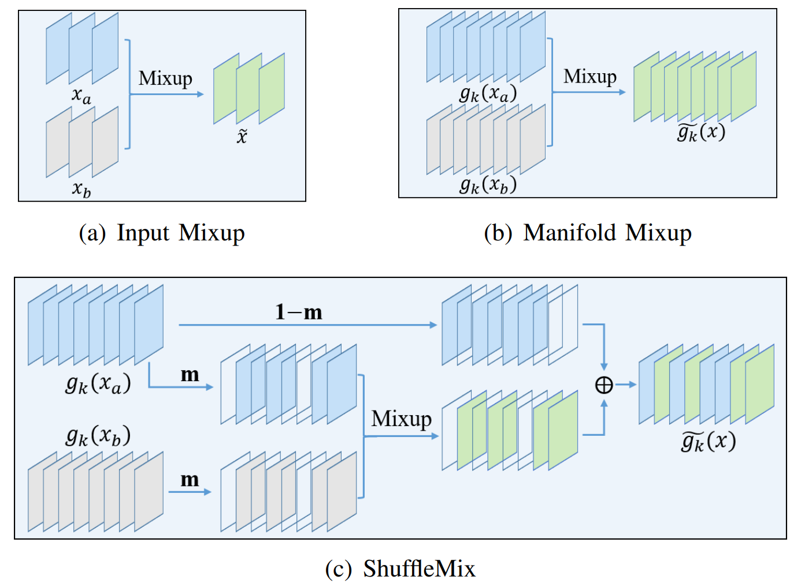
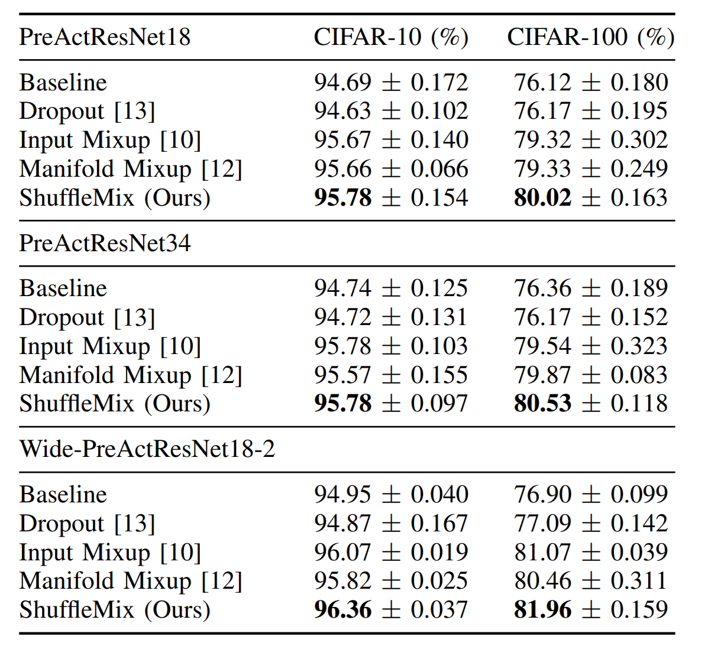

# ShuffleMix

ShuffleMix is a simple, inexpensive yet effective data augmentation method that can help improve the predictive accuracy
and robustness of vision models. 



## Setup
### Install Package Dependencies
```
torch torchvision tensorboardX
```

### Datasets
cifar10/100

[tiny_imageNet](http://cs231n.stanford.edu/tiny-imagenet-200.zip)

You can download datasets to `./data`, or give a data_root in args.

## Implementation
The implementations of the Manifold Mixup and our ShuffleMix are based on the hook mechanism of [Pytorch](https://pytorch.org/).
```
def hook_modify(self, module, input, output):
    cx = int(output.size(1) * self.ratio)
    if self.index_type == 'random':
        cx_index = np.random.choice(output.size(1), cx, replace=False)
        if self.ada_dropout:
            output[:, cx_index] = output[:, cx_index] * 0; self.lam = 1
        else:
            output[:, cx_index] = output[:, cx_index] * self.lam + output[self.indices][:,cx_index] * (1-self.lam)
    else:
        output[:, :cx] = output[:, :cx] * self.lam + output[self.indices][:, :cx] * (1-self.lam)
    self.lam = 1 - cx / output.size(1) * (1 - self.lam)
    output = self._noise(output, self.add_noise_level, self.mult_noise_level)
    return output
```
For more details, please refer to ```src\shufflemix.py ``` 
## ShuffleMix-NFM
This is combining our ShuffleMix with Noisy Feature Mixup ([NFM](https://arxiv.org/abs/2110.02180)) for achieving better robustness against noises.
```
def _noise(x, add_noise_level=0.0, mult_noise_level=0.0, sparsity_level=0.0):
    add_noise = 0.0
    mult_noise = 1.0
    with torch.cuda.device(0):
        if add_noise_level > 0.0:
            add_noise = add_noise_level * np.random.beta(2, 5) * torch.cuda.FloatTensor(x.shape).normal_()
        if mult_noise_level > 0.0:
            mult_noise = mult_noise_level * np.random.beta(2, 5) * (2*torch.cuda.FloatTensor(x.shape).uniform_()-1) + 1 
    return mult_noise * x + add_noise
```

## Criterion
The criterion that we use for training the model is similar to the original mixup criterion.

```
def mixup_criterion(criterion, pred, y_a, y_b, lam):
    return lam * criterion(pred, y_a) + (1 - lam) * criterion(pred, y_b)
```
## Training
To train a model on the cifar100 dataset using the preactresnet18 backbone

```python train.py --name cifar100 --arch preactresnet18 --seed 1 --mixmethod ShuffleMix --alpha 1 --mix_type soft --ratio 0.5 --index_type random --k_layer1 -1 --k_layer2 4```

For more training details, please refer to ```scripts\*.sh``` or our paper [ShuffleMix](https://arxiv.org/pdf/2305.18684v1.pdf).

If you want to evaluate the model under different noises, please run ```evaluate.py```for evaluation.

## Results


For more results, please refer to our paper [ShuffleMix](https://arxiv.org/pdf/2305.18684v1.pdf).

## Citation
If you find our paper and repo useful, please cite our paper.
```commandline
@article{liu2023shufflemix,
title={ShuffleMix: Improving Representations via Channel-Wise Shuffle of Interpolated Hidden States},
author={Liu, Kangjun and Chen, Ke and Guo, Lihua and Wang, Yaowei and Jia, Kui},
journal={arXiv preprint arXiv:2305.18684},
year={2023}
}
```
## Contact
If you have any questions about our work, feel free to contact us through email (wikangj.liu@mail.scut.edu.cn) or Github issues.

## Acknowledgement
The structure of this codebase is borrowed from this pytorch implementataion of [NFM](https://github.com/erichson/NFM).